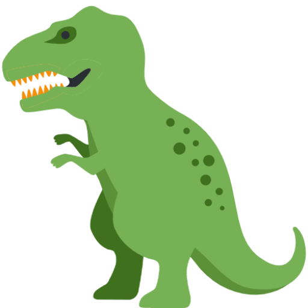

<!-- PROJECT SHIELDS -->
<!--
*** I'm using markdown "reference style" links for readability.
*** Reference links are enclosed in brackets [ ] instead of parentheses ( ).
*** See the bottom of this document for the declaration of the reference variables
*** for contributors-url, forks-url, etc. This is an optional, concise syntax you may use.
*** https://www.markdownguide.org/basic-syntax/#reference-style-links
-->

<!-- PROJECT LOGO -->
 

  

  <h3 align="center">Project Chat App</h3>

  

    This is simple Chat App based upon Firebase and React
     
    <a href="https://react-slack-156cc.web.app">View Demo</a>
  

<!-- TABLE OF CONTENTS -->

  
Table of Contents

  <ol>
    <li>
      <a href="#about-the-project">About The Project</a>
      <ul>
        <li><a href="#built-with">Built With</a></li>
      </ul>
    </li>
    <li><a href="#contact">Contact</a></li>
  </ol>

<!-- ABOUT THE PROJECT -->

## About The Project

[![Product Name Screen Shot][product-screenshot]](#about-the-project)

Typescript를 이용하여 코드를 작성했습니다. Firebase와 React를 이용하여 만든 실시간 채팅 웹 앱입니다. firebase에서 제공하는 authentication, realtime database, storage 서비스를 이용하여 백엔드 부분을 구성했습니다. React와 semantic ui 라이브러리, 기본적인 CSS를 이용하여 UI를 만들었습니다. 상태 관리로 Redux를 이용했습니다.

### Built With

- [React](https://reactjs.org/)
- [Firebase](https://firebase.google.com/?gclid=CjwKCAjwlrqHBhByEiwAnLmYULAPUE9fk_6V0cVOw2wwPlzKPf5tyctTE3BGgP76k6TMhoHRrDjkSxoC1D4QAvD_BwE&gclsrc=aw.ds)
- [Redux](https://redux.js.org/)
- [Semantic UI React](https://react.semantic-ui.com/)
- [Typescript](https://www.typescriptlang.org/)

## Contact

Lee Jongseo - [gmail](goldemshine@gmail.com) - goldemshine@gmail.com

Project Link: [Repo](https://github.com/leejss/project-chat)

[product-screenshot]: ./project1.PNG
